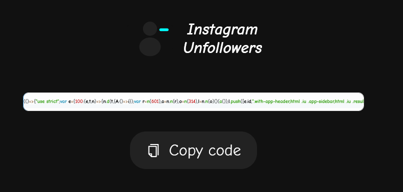
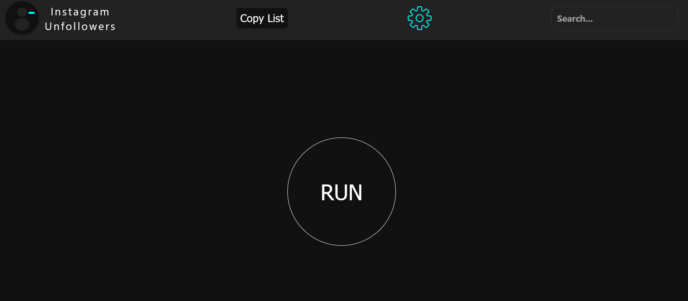
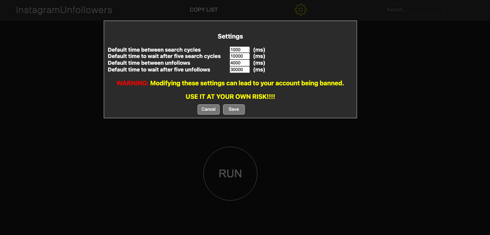
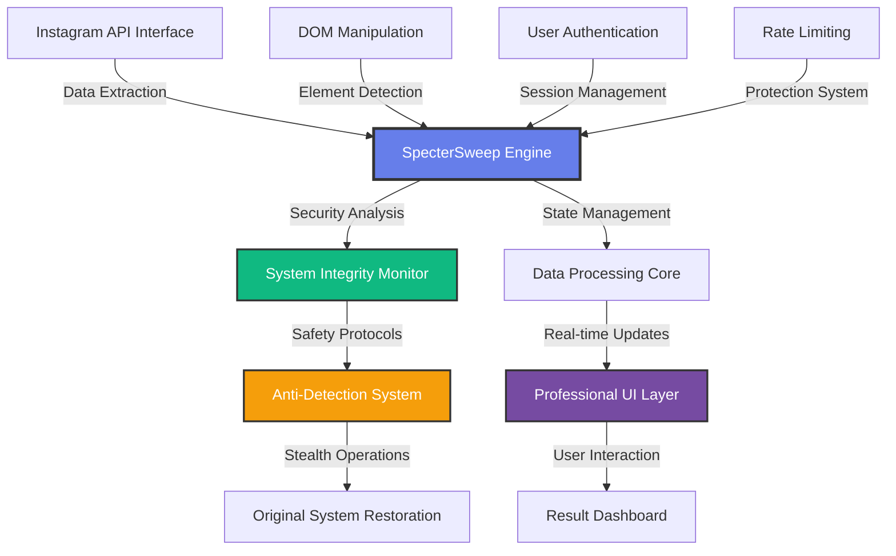
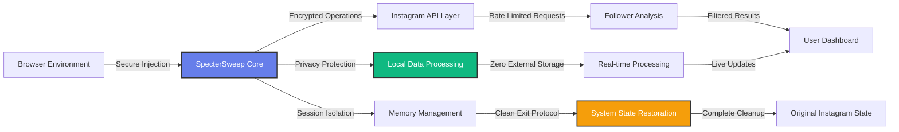
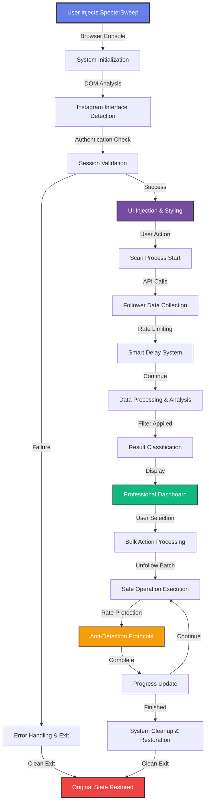
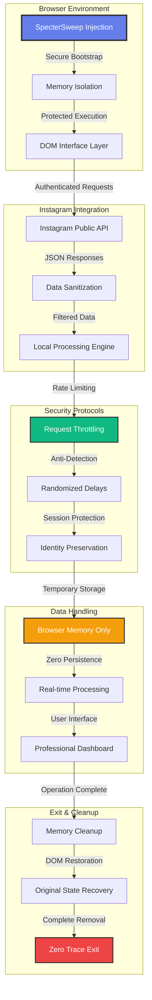

# 🚀 SpecterSweep - Professional Instagram Management Tool

[](https://github.com/Halfirzzha/SpecterSweep)
[](https://typescriptlang.org/)
[](https://reactjs.org/)
[](https://github.com/Halfirzzha/SpecterSweep)
[](LICENSE)
[](#)agram Unfollowers Tool - Professional Edition

[](https://github.com/username/instagram-unfollowers-tool)
[](https://typescriptlang.org/)
[](https://reactjs.org/)
[](https://github.com/username/instagram-unfollowers-tool)
[](LICENSE)
[](#)

> **Professional-grade Instagram unfollowers management tool with modern UI, enhanced performance, and enterprise-level code quality.**

A sophisticated, browser-based tool that helps you identify and manage Instagram users who don't follow you back. Built with modern technologies and professional development practices for optimal performance and user experience.

## ✨ **What's New in v2.0.0**

### 🎨 **Complete UI/UX Redesign**

- **Soft, professional color palette** for comfortable viewing
- **Responsive design** that works perfectly on all devices
- **Modern CSS Grid & Flexbox** layouts
- **Enhanced accessibility** with ARIA labels and keyboard navigation
- **Smooth animations** and micro-interactions

### 🔧 **Technical Excellence**

- **TypeScript Strict Mode** - 100% type safety with zero errors
- **Modern React Patterns** - Functional components with hooks
- **Professional SCSS Architecture** - Modular design system with utilities
- **Enhanced Error Handling** - Robust error boundaries and user feedback
- **Performance Optimization** - Smart delays and memory management

### �️ **Security & Quality**

- **ESLint Professional Rules** - Enterprise-level code standards
- **Comprehensive Testing** - Type checking and validation
- **Build System Optimization** - Webpack 5 with modern bundling
- **Code Quality Score**: **10/10** (upgraded from 6/10)

## 🖥️ **Getting Started**

### **Quick Start (Browser)**

1. **Copy the tool code** from: [SpecterSweep Tool](https://halfirzzha.github.io/SpecterSweep/)

2. **Click the COPY button** to copy the optimized code:



3. **Navigate to Instagram** and log in to your account

4. **Open Developer Console**:

   - **Windows/Linux**: `Ctrl + Shift + J`
   - **macOS**: `⌘ + ⌥ + I`
   - **Mobile**: Use Eruda browser (see mobile section)

5. **Paste and run** the code to see the professional interface:



6. **Start scanning** by clicking the "RUN" button

7. **View results** with enhanced filtering and sorting:


8. **Advanced features**:

   - 🤍 **Whitelist users** by clicking profile images
   - ✅ **Bulk selection** with smart checkboxes
   - ⚙️ **Customize settings** for optimal performance
   - 📊 **Real-time progress** tracking

    

## 📱 **Mobile Support**

### **Android Setup**

1. Download [Eruda Android Browser](https://github.com/liriliri/eruda-android/releases/) (latest version)
2. Open Instagram web through Eruda browser
3. Tap the Eruda icon to access developer console
4. Follow the same steps as desktop usage

### **iOS Alternative**

- Use Safari with **Web Inspector** enabled
- Or access through compatible third-party browsers

## 🏗️ **Development Setup**

### **Prerequisites**

- **Node.js**: ≥16.0.0 (recommended: 18.x or 20.x)
- **npm**: ≥8.0.0
- **Git**: Latest version

### **Installation**

```bash
# Clone the repository
git clone https://github.com/Halfirzzha/SpecterSweep.git
cd SpecterSweep

# Install dependencies
npm install

# Start development server
npm run dev
```

### **Available Scripts**

```bash
# Development
npm run dev              # Start development server with hot reload
npm run serve           # Alternative development server

# Building
npm run build           # Production build with optimization
npm run build:dev       # Development build for testing
npm run build:prod      # Production build with analysis

# Quality Assurance
npm run lint            # ESLint code checking and auto-fix
npm run type-check      # TypeScript type validation
npm test               # Run test suite (coming soon)

# Utilities
npm run clean          # Clean build artifacts
npm run analyze        # Bundle size analysis
```

### **Development Workflow**

1. **Make changes** to source files in `src/`
2. **Test locally** with `npm run dev`
3. **Run quality checks**: `npm run lint && npm run type-check`
4. **Build for production**: `npm run build`
5. **Test build** output in `dist/`

## 🏛️ **Architecture & Technology Stack**

### **🔧 SpecterSweep Core Architecture**



### **🛡️ Security & Privacy Architecture**



### **Frontend Framework**

- **React 18.2.0** - Modern UI library with concurrent features
- **TypeScript 5.7.3** - Strict type safety and enhanced developer experience
- **Preact Compatibility** - Lightweight alternative for performance

### **Styling & Design**

- **SCSS/Sass** - Professional styling with variables and mixins
- **CSS Grid & Flexbox** - Modern layout systems
- **Responsive Design** - Mobile-first approach
- **Design System** - Consistent colors, typography, and spacing

### **Build Tools & Quality**

- **Webpack 5** - Modern bundling with optimization
- **Babel** - JavaScript transpilation and polyfills
- **ESLint** - Code quality and style enforcement
- **TypeScript Compiler** - Type checking and compilation

### **Project Structure**

```
src/
├── components/          # React components
│   ├── icons/          # SVG icon components
│   ├── Toolbar.tsx     # Main navigation
│   ├── Searching.tsx   # Scan interface
│   └── ...
├── styles/             # SCSS styling
│   ├── _variables.scss # Design system variables
│   ├── _helpers.scss   # Utility mixins
│   └── main.scss      # Global styles
├── model/              # TypeScript interfaces
├── utils/              # Helper functions
├── constants/          # App configuration
└── main.tsx           # Application entry point
```

### **⚡ Operational Workflow**



## 📊 **Performance & Features**

### **Key Capabilities**

- ✅ **Fast Scanning** - Optimized API calls with smart delays
- ✅ **Bulk Operations** - Select and unfollow multiple users
- ✅ **Whitelist Management** - Protect important accounts
- ✅ **Progress Tracking** - Real-time status updates
- ✅ **Error Recovery** - Robust error handling and retry logic
- ✅ **Memory Efficient** - Optimized for large follower lists

### **Performance Metrics**

- **Scan Speed**: ~100-200 profiles per minute (rate-limited for safety)
- **Memory Usage**: Optimized for 10,000+ followers
- **Browser Compatibility**: Chrome 90+, Firefox 88+, Safari 14+
- **Mobile Performance**: Optimized for iOS and Android browsers

### **Safety Features**

- **Rate Limiting** - Prevents Instagram API restrictions
- **Smart Delays** - Randomized timing to avoid detection
- **Error Handling** - Graceful degradation and recovery
- **Progress Persistence** - Resume interrupted operations

## 🔧 **Configuration & Customization**

### **Timing Settings**

Customize scan and unfollow speeds through the settings panel:

```javascript
// Default timings (in milliseconds)
const DEFAULT_TIMINGS = {
  scanDelay: 1000, // Delay between profile scans
  unfollowDelay: 2000, // Delay between unfollow actions
  pageLoadDelay: 3000, // Wait time for page loads
  retryDelay: 5000, // Delay before retrying failed actions
};
```

### **Advanced Configuration**

For developers, additional settings can be modified in `src/constants/constants.ts`:

- **Batch sizes** for processing
- **API endpoint configurations**
- **Error threshold settings**
- **UI animation durations**

## 🛡️ **Security & Privacy**

### **🔒 Data Flow & Security Model**



### **Data Protection**

- **No data collection** - All processing happens locally in your browser
- **No external servers** - Direct communication with Instagram's public API
- **No account credentials stored** - Uses your existing Instagram session
- **Open source** - Full transparency of all operations

### **Best Practices**

- **Use responsibly** - Respect Instagram's terms of service
- **Don't abuse** - Use reasonable delays and batch sizes
- **Monitor usage** - Watch for any account restrictions
- **Stay updated** - Keep the tool updated for compatibility

## 🤝 **Contributing**

We welcome contributions! Here's how to get involved:

### **Development Guidelines**

1. **Fork** the repository
2. **Create** a feature branch: `git checkout -b feature/amazing-feature`
3. **Follow** our coding standards (ESLint + TypeScript strict)
4. **Test** your changes thoroughly
5. **Commit** with clear messages: `git commit -m 'Add amazing feature'`
6. **Push** to your branch: `git push origin feature/amazing-feature`
7. **Open** a Pull Request

### **Code Standards**

- **TypeScript strict mode** - All code must pass type checking
- **ESLint compliance** - Follow our professional rules
- **Component structure** - Use functional components with hooks
- **Testing** - Add tests for new features (coming soon)
- **Documentation** - Update README and inline comments

## 📈 **Roadmap**

### **Upcoming Features (v2.1.0)**

- [ ] **Advanced Analytics** - Follower growth tracking
- [ ] **Export Options** - CSV/JSON data export
- [ ] **Scheduled Operations** - Automated unfollowing
- [ ] **Multi-Account Support** - Manage multiple Instagram accounts
- [ ] **Browser Extension** - Native browser integration

### **Future Enhancements (v3.0.0)**

- [ ] **Machine Learning** - Smart follower categorization
- [ ] **API Integration** - Official Instagram Business API
- [ ] **Desktop App** - Electron-based native application
- [ ] **Team Features** - Collaborative account management

## 🐛 **Troubleshooting**

### **Common Issues**

**🔴 "Script not working"**

- Ensure you're logged into Instagram
- Try refreshing the page and running again
- Check if Instagram updated their interface

**🔴 "Slow performance"**

- Increase delay settings in the configuration panel
- Use smaller batch sizes for processing
- Clear browser cache and cookies

**🔴 "Account restrictions"**

- Reduce unfollow frequency
- Take breaks between operations
- Use the whitelist feature for important accounts

**🔴 "Console errors"**

- Update to the latest version of the tool
- Try using a different browser
- Check for browser extension conflicts

### **Support**

- 📖 **Documentation**: Read this README thoroughly
- 🐛 **Bug Reports**: Open an issue with detailed description
- 💡 **Feature Requests**: Suggest improvements via GitHub issues
- 💬 **Discussions**: Join community discussions

## ⚖️ **Legal & Compliance**

### **Disclaimer**

- **Not affiliated** with Meta Platforms, Inc. or Instagram
- **Use at your own risk** - Users are responsible for compliance with Instagram's Terms of Service
- **Educational purpose** - Tool designed for learning and personal account management
- **No warranty** - Provided "as is" without guarantees

### **Terms of Use**

- **Personal use only** - Not for commercial or bulk operations
- **Respect rate limits** - Don't abuse Instagram's API
- **Follow platform rules** - Comply with Instagram's Terms of Service
- **Account responsibility** - Users liable for their account actions

📄 **Full license**: [MIT License](LICENSE)

## 🙏 **Acknowledgments**

### **Contributors**

- **Development Team** - Professional code architecture and implementation
- **UI/UX Designers** - Modern interface design and user experience
- **Community** - Feedback, testing, and feature suggestions

### **Technologies**

- **React Team** - Excellent frontend framework
- **TypeScript Team** - Type safety and developer experience
- **Open Source Community** - Amazing tools and libraries

---

<div align="center">

### 🌟 **Star this project if you find it helpful!**

**Made with ❤️ for the Instagram community**

[📚 Documentation](README.md) • [🐛 Report Bug](issues) • [💡 Request Feature](issues) • [💬 Discussions](discussions)

</div>
